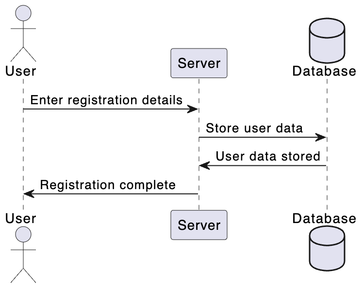

# Documento di Specifica del Progetto

## Titolo del Progetto
**Nome:** Sistema di Gestione Bibliotecaria

## Scopo del Progetto
Il progetto mira a sviluppare un'applicazione Java per la gestione di una biblioteca. L'applicazione consentirà agli utenti di cercare e prenotare libri, gestire il proprio account e consentirà ai bibliotecari di gestire l'inventario e le prenotazioni dei libri.

## Requisiti Funzionali

1. **Autenticazione**
    - Gli utenti devono essere in grado di registrare un account.
    - Gli utenti registrati devono essere in grado di effettuare il login.
    - Gli utenti possono reimpostare la password dimenticata.

2. **Ricerca Libri**
    - Gli utenti devono essere in grado di cercare libri per titolo, autore o genere.
    - I risultati della ricerca devono essere visualizzati in modo chiaro.

3. **Prenotazione**
    - Gli utenti devono essere in grado di prenotare libri disponibili.
    - Gli utenti possono visualizzare le prenotazioni attive e cancellarle.

4. **Gestione Libri**
    - I bibliotecari devono essere in grado di aggiungere nuovi libri all'inventario.
    - I bibliotecari possono segnare i libri come restituiti.
    - I bibliotecari possono visualizzare le prenotazioni dei libri.

5. **Account Utente**
    - Gli utenti possono aggiornare le proprie informazioni personali.
    - Gli utenti possono visualizzare lo storico delle prenotazioni.

6. **Interfaccia Utente**
    - L'interfaccia utente deve essere intuitiva ed esteticamente gradevole.
    - Deve essere possibile navigare facilmente tra le diverse funzionalità.

## Requisiti Non Funzionali

1. **Performance**
    - L'applicazione deve rispondere rapidamente alle richieste degli utenti.
    - Le operazioni di ricerca devono essere veloci anche con un grande numero di libri.

2. **Sicurezza**
    - Le informazioni degli utenti devono essere archiviate in modo sicuro.
    - L'accesso alle funzionalità di amministrazione deve essere limitato ai bibliotecari autorizzati.

3. **Manutenibilità**
    - Il codice sorgente deve essere ben strutturato e documentato.
    - Le modifiche future devono essere facili da implementare.

## Tecnologie e Strumenti

- Linguaggio di programmazione: Java
- Database: SQLite (opzionale)
- IDE: Eclipse, NetBeans, IntelliJ IDEA o simili
- Strumenti di controllo di versione: Git

## Casi d'Uso
1. **Registrazione utente**\
Attori Principali: Utente\
Scopo: L'utente può registrare un nuovo account nel sistema.\
    Flusso Principale:
    - L'utente avvia il processo di registrazione.
    - Il sistema richiede all'utente di inserire le informazioni necessarie per la registrazione, come nome, cognome, indirizzo email e password.
    - L'utente inserisce le informazioni richieste.
    - Il sistema verifica se le informazioni sono valide e univoche.
    - Se le informazioni sono valide, il sistema crea un nuovo account utente.
    - Il sistema invia una conferma di registrazione all'indirizzo email specificato dall'utente.
    - L'utente conferma la registrazione cliccando sul link di conferma nell'email.

    Flusso Alternativo:
    - Se le informazioni non sono valide o l'indirizzo email è già in uso, il sistema mostra un messaggio di errore e richiede all'utente di correggere le informazioni.
    - Se l'utente non conferma la registrazione entro un certo periodo, l'account non viene attivato e il processo di registrazione deve essere ripetuto.
    
    Postcondizioni: 
    - L'utente ha un account attivo nel sistema e può effettuare il login.
    
    Note:
     - Dopo la registrazione, l'utente può effettuare il login con le credenziali create.
    - L'utente può anche recuperare la password dimenticata tramite un'apposita funzionalità.

    

3. **Prenotazione di un Libro**\
Attori Principali: Utente\
Scopo: L'utente può prenotare un libro disponibile nella biblioteca.\
Flusso Principale:
    - L'utente effettua il login nel sistema.
    - L'utente avvia la ricerca di un libro utilizzando il titolo, l'autore o il genere.
    - Il sistema mostra i risultati della ricerca.
    - L'utente seleziona il libro desiderato dalla lista dei risultati.
    - Il sistema verifica se il libro è disponibile per la prenotazione.
    - Se il libro è disponibile, l'utente conferma la prenotazione.
    - Il sistema registra la prenotazione nel sistema.
    - L'utente riceve una conferma della prenotazione.

    Flusso Alternativo:
    - Se il libro non è disponibile, il sistema mostra un messaggio che indica che il libro è già prenotato da un altro utente.
    - L'utente può scegliere di annullare la prenotazione o cercare un altro libro.

    Postcondizioni: Il libro è prenotato dall'utente e non è più disponibile per altre prenotazioni finché non viene restituito.
    Note:
    - Gli utenti possono visualizzare le loro prenotazioni attive nel proprio account.
    - I bibliotecari possono visualizzare le prenotazioni dei libri e gestire le restituzioni.

## Conclusioni
Questo documento di specifica del progetto fornisce una panoramica generale del Sistema di Gestione Bibliotecaria. Sarà utile come guida durante lo sviluppo del software.
